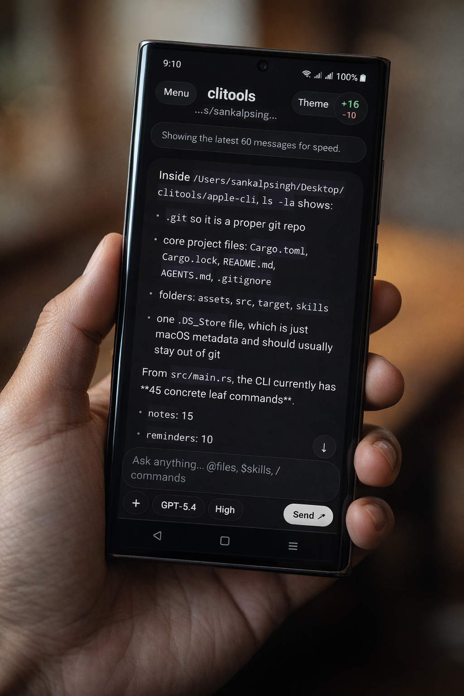

# Phoenix Mobile

Phoenix Mobile is an Android-first client for a local Phoenix backend. The phone app does not bundle the backend inside the APK. You run the backend on your computer, then connect the phone to it over your local network.

## Preview

<p align="center">
  
</p>

This repo contains:

- the Expo / React Native mobile app
- a nested backend package in [server](/Users/sankalpsingh/Desktop/codexapp/kanna-mobile/server)

## What You Need

Install these first:

- `Node.js` 20+ with `npm`
- `Bun` 1.3.5+
- `Android Studio` if you want to build or run Android locally
- `Codex` installed on your computer if you want the Codex provider
- optionally `Claude Code` if you want the Claude provider

Recommended checks:

```bash
node -v
npm -v
bun -v
codex --version
```

## Clone And Install

Clone the repo:

```bash
git clone git@github.com:Sankalpcreat/Phoenix.git
cd Phoenix
```

Install the mobile app dependencies:

```bash
npm install
```

Install the backend dependencies:

```bash
cd server
bun install
cd ..
```

## Run The Backend

For local desktop use:

```bash
npm run server
```

For a physical phone on the same Wi-Fi network:

```bash
npm run server:remote
```

That starts the backend on port `3210`.

Useful endpoints:

- health check: `http://YOUR_HOST:3210/health`
- websocket: `ws://YOUR_HOST:3210/ws`

## Run The Android App

Start the Android app:

```bash
npm run android
```

If you prefer Expo dev server:

```bash
npm run start
```

## Connect The Phone

When the app opens, enter your backend URL in the server field inside the app.

Examples:

- Android emulator using host loopback:
  `http://10.0.2.2:3210`
- Physical phone on same Wi-Fi:
  `http://192.168.x.x:3210`
- Tailscale, if you choose to use it:
  `http://100.x.x.x:3210`

Notes:

- `localhost` on the phone is not your computer
- Tailscale is optional, not required
- the repo does not ship a hardcoded private server URL

## Provider Requirements

Phoenix Mobile can talk to different backends/providers, but those tools must exist on the computer running the backend.

For Codex:

- install `codex`
- make sure it is available on `PATH`
- authenticate it on that machine before starting the backend

For Claude:

- install the Claude CLI you use
- make sure it is available on `PATH`

## Development Commands

Mobile app:

```bash
npm run start
npm run android
npm run ios
npm run lint
npx tsc --noEmit
```

Backend:

```bash
cd server
bun run start -- --no-open
bun run start -- --no-open --host 0.0.0.0
bun run check
```

## Before You Push

Check these:

- no private IPs are hardcoded in the app
- no `.env` files are added
- no keys, certificates, or tokens are committed
- `node_modules`, `.expo`, and backend dependencies stay untracked

Useful checks:

```bash
git status --short --ignored=matching
rg -n --no-ignore --hidden --glob '!**/node_modules/**' --glob '!**/.git/**' 'OPENAI_API_KEY|ANTHROPIC_API_KEY|GITHUB_TOKEN|PRIVATE KEY|sk-' .
```

## Troubleshooting

If the phone cannot connect:

- confirm the backend is running
- open `http://YOUR_HOST:3210/health` from another device on the same network
- make sure the phone and computer are on the same network
- use `server:remote` for a real phone
- re-enter the server URL inside the app and tap reconnect

If Codex does not respond:

- verify `codex --version`
- verify Codex is authenticated on the host machine
- restart the backend after authentication changes
